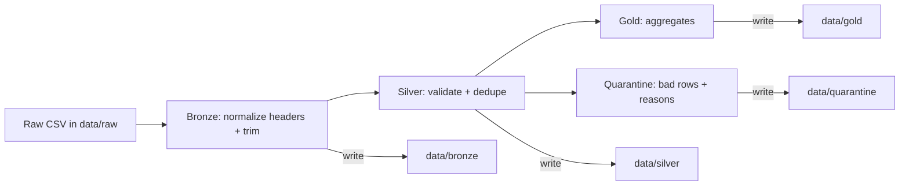

# nfl-injuries-mini-local

A **tiny, local-only** Medallion pipeline (**Raw → Bronze → Silver → Gold**) for **NFL injury CSV** data.

## Quick Design Facts
- ✅ Quarantine (bad rows do NOT break the batch)
- ✅ One file per stage (bronze / silver / gold)
- ✅ Virtual env + Makefile
- ✅ Schema config file (barebones JSON)
- ✅ Runs locally using a Windows-friendly **Bash** workflow (Git Bash)

---

## What you get (outputs)

After running `make run`, you get:

- **Bronze**: `data/bronze/injuries_bronze.csv`  
  Standardized ingest copy (normalized headers + trimmed strings).

- **Silver**: `data/silver/injuries_silver.csv`  
  Clean, validated rows only.

- **Quarantine**: `data/quarantine/injuries_quarantine.csv`  
  Bad rows + `quarantine_reason` (pipeline still completes).

- **Gold**:
  - `data/gold/injuries_by_team_week.csv`
  - `data/gold/injuries_by_position.csv`

---

## Folder structure

```text
NFL-INJURIES-MINI-LOCAL/
├─ .venv/                         # Local Python virtual environment (don’t commit)
│
├─ data/                          # Local data lake (generated + inputs)
│  ├─ raw/                        # Input CSVs you drop in (source-of-truth for local runs)
│  ├─ bronze/                     # “As-ingested” standardized copy (minimal changes)
│  ├─ silver/                     # Validated/cleaned dataset (schema enforced)
│  ├─ quarantine/                 # Bad rows + rejection reasons (pipeline continues)
│  └─ gold/                       # Aggregations / analytics-ready outputs
│
├─ pipeline/                      # Pipeline package (importable Python modules)
│  ├─ __pycache__/                # Python bytecode cache (don’t commit)
│  ├─ raw.py                      # Raw helpers (optional utils for raw stage / IO)
│  ├─ bronze.py                   # Bronze stage logic: read raw -> write bronze
│  ├─ silver.py                   # Silver stage logic: validate + quarantine -> write silver/quarantine
│  ├─ gold.py                     # Gold stage logic: aggregations -> write gold outputs
│  ├─ paths.py                    # Central “filesystem contract”: repo paths + ensure_dirs()
│  ├─ reporting.py                # Logging/report helpers (pretty summary output)
│  └─ runner.py                   # Orchestrator: runs stages and returns PipelineRunResult
│
├─ schema/                        # Data contracts (versionable, source-controlled)
│  └─ injuries_schema.json        # Silver-stage schema used for validation/quarantine rules
│
├─ scripts/                       # CLI entrypoints (thin wrappers around pipeline package)
│  └─ run_pipeline.py             # One-command runner (sets logging, calls runner.run())
│
├─ .gitignore                     # Keep junk out of git (data outputs, venv, caches, etc.)
├─ Makefile                       # Convenience commands (setup/run/clean) for quick demos
├─ README.md                      # How to run + what it produces (this file)
└─ requirements.txt               # Python dependencies (pin versions if you want repeatability)

```

---

## Requirements (Windows Bash)

This repo assumes you are running **Bash on Windows**, typically:
- **Git Bash** (from Git for Windows), or
- **WSL** (Ubuntu, etc.)

You also need:
- **Python 3.10+** installed and on PATH
- Optional but recommended: **make**
  - If `make` is not found in Git Bash, install it (MSYS2 is the cleanest option), or run the “No make?” commands below.


## Common commands

```bash
make run          # run full pipeline
make clean-data   # delete output CSVs (bronze/silver/gold/quarantine)
make clean-venv   # delete .venv
make reset        # clean-data + rebuild venv + install + run
```

---


## Quick start (using Makefile)

From the repo root:

```bash
make help
make venv
make install
make run
```

That produces:
- `data/bronze/injuries_bronze.csv`
- `data/silver/injuries_silver.csv`
- `data/quarantine/injuries_quarantine.csv`
- `data/gold/injuries_by_team_week.csv`
- `data/gold/injuries_by_position.csv`

---

## Manual commands (no make)

From the repo root in Git Bash:

```bash
# 1) Create venv
python -m venv .venv

# 2) Install dependencies
.venv/Scripts/pip install -r requirements.txt

# 3) Run the pipeline
.venv/Scripts/python scripts/run_pipeline.py
```

Run against a specific raw file:

```bash
.venv/Scripts/python scripts/run_pipeline.py data/raw/injuries_raw.csv
```
---

## Schema contract (barebones)

The pipeline expects the **default training file**:
- `data/raw/injuries_raw.csv`

The schema is defined in:
- `schema/injuries_schema.json`

Example (trimmed):

```json
{
  "required": {
    "season": "int",
    "week": "int",
    "team": "str",
    "player": "str",
    "position": "str",
    "injury": "str",
    "status": "str"
  },
  "optional": {
    "practice_status": "str",
    "report_date": "date"
  },
  "primary_key": ["season", "week", "team", "player", "injury"],
  "week_range": [1, 22]
}
```

Notes:
- This is intentionally **not** a full-blown schema framework.
- It’s just enough to practice the idea of a data contract and validation.

---

## What each stage does (simple + practical)

### Raw
- Your input CSV (example: `data/raw/injuries_raw.csv`)

### Bronze (`pipeline/bronze.py`)
Goal: **make the file consistent**
- normalizes column names (lowercase, underscores)
- trims whitespace
- writes a clean bronze CSV

### Silver (`pipeline/silver.py`)
Goal: **keep good rows, quarantine bad rows**

Silver applies a few clean rules you’ll see constantly in real pipelines:

1. **Schema validation (file-level)**
   - If any **required columns** are missing, the run fails fast.

2. **Null / blank checks (row-level)**
   - Required fields cannot be null or blank.

3. **Type checks (row-level)**
   - `season` and `week` must be integers.

4. **Range check (row-level)**
   - `week` must be within `week_range` (default: 1..22).

5. **Date check (row-level, optional)**
   - If `report_date` exists, it must parse as a date (`YYYY-MM-DD` recommended).

6. **Duplicate check (row-level)**
   - Duplicates by `primary_key` are quarantined (the first instance is kept).

Quarantine rows get a `quarantine_reason` string, e.g.:

```text
missing_required_field; invalid_week; duplicate_record
```

### Gold (`pipeline/gold.py`)
Goal: **tiny “analytics-ready” outputs**
- aggregates injuries by team/week
- aggregates injuries by position

---

---

## Architecture



---

## Common tweaks you’ll actually do in real life

- **Change the primary key** (schema file):
  - If your source has `player_id`, use that instead of `player`.

- **Adjust validation strictness**:
  - Maybe you allow blank `injury` but require `status`.

- **Add one more Gold output**:
  - Example: injuries by `status` and `team`.

---


## Troubleshooting (the usual stuff)

### “ModuleNotFoundError: pipeline …”
You are running from the wrong directory.
- ✅ Run from the repo root:
  - `make run`
  - or `python scripts/run_pipeline.py`

### Quarantine is huge / silver is tiny
That usually means the raw file doesn’t match the expected columns/types.
- check `schema/injuries_schema.json`
- check your raw column names (Bronze normalizes names, but it can’t invent missing fields)

### `make: command not found`
You don’t have make installed in your Bash environment.
- Use the “No make?” commands above, or install make.

---

## License

MIT.